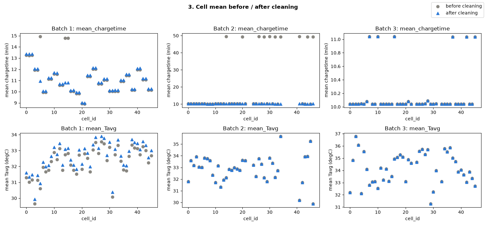

# ESS 배터리 수명 예측

배터리 셀 하나의 **초기 100사이클**에서 관측한 충전시간, 온도, 방전 곡선 변화로 해당 셀의 **수명 종료까지 총 사이클 수(`cycle_life`)**를 예측합니다.

예상 수명이 짧은 셀의 선별·점검과 교체 계획에 참고할 수 있는 근거를 만드는 것이 목적입니다.

## 프로젝트 개요

- 데이터셋 : MIT-Stanford Battery Dataset (Severson et al., Nature Energy 2019)
- 학습 데이터 : Batch 1 (2017-05-12)
- 평가 데이터 : Batch 2 (2018-02-20)
- 추가 평가 : Batch 3 (2018-04-12)는 EDA에만 사용하고 모델 평가 X
- 태스크 : Regression (Cycle Life 예측)
- 타깃 : `cycle_life` — 용량이 초기의 80%에 도달할 때까지의 총 사이클 수
- 평가지표 : MAPE (%)

## 파일 구조

```text
├── data/
│   ├── README.md                  # 배치별 EDA 상세 결과
│   └── archive/                   # 원본 MAT 파일 (Git 제외)
├── notebooks/
│   └── ESSHealth-scratch.ipynb    # EDA 노트북
├── images/                        # EDA·전처리 그래프
├── src/
│   ├── preprocess.py              # 데이터 로딩, 이상값 처리, 분할, 결측 대체, 표준화
│   ├── features.py                # 피처 4개 생성
│   └── train.py                   # Ridge 학습, MAPE 평가, 결과 저장
├── tests/
│   ├── test_report_features.py    # 피처·전처리 단위 테스트
│   └── check_valid_range.py       # 정상 범위 확인용 그래프
├── results/
│   └── model_performance.csv
├── requirements.txt
└── README.md
```

## 환경 설정

Python 3.11 기준

```bash
git clone https://github.com/xxhigh/skala-data-mini-project
cd skala-data-mini-project
python3 -m venv .venv
source .venv/bin/activate
pip install -r requirements.txt
```

### 데이터 준비

[Kaggle 데이터셋](https://www.kaggle.com/datasets/itshpark/data-driven-prediction-of-battery-cycle)에서 아래 파일을 받아 `data/archive/`에 둔다.

```text
data/archive/2017-05-12_batchdata_updated_struct_errorcorrect.mat   # Batch 1
data/archive/2018-02-20_batchdata_updated_struct_errorcorrect.mat   # Batch 2
data/archive/2018-04-12_batchdata_updated_struct_errorcorrect.mat   # Batch 3 (EDA용)
```

### 실행

```bash
python src/train.py                       # 학습·평가, results/model_performance.csv 저장
python tests/check_valid_range.py         # 정상 범위 확인 그래프
python -m unittest discover -s tests      # 단위 테스트
```

## EDA

상세 내용과 전체 그래프는 [data/README.md](data/README.md)에서 볼 수 있습니다.

### Cycle Life 분포

| 지표                |     Batch 1 |     Batch 2 |     Batch 3 |
| ------------------- | ----------: | ----------: | ----------: |
| 수명값이 있는 셀 수 |          46 |          39 |          44 |
| 평균 수명           |       844.7 |       565.7 |     1,059.7 |
| 중앙값              |       858.5 |       472.0 |     1,005.5 |
| 최솟값 ~ 최댓값     | 534 ~ 1,227 | 392 ~ 1,186 | 541 ~ 1,935 |
| 단수명(<500) 비율   |          0% |       71.8% |          0% |
| 장수명(>1,000) 비율 |       21.7% |        7.7% |       52.3% |


- 수명은 Batch 3 > Batch 1 > Batch 2
- **단수명 셀은 Batch 2에만 있고, 학습 배치(Batch 1)의 최솟값 534보다 짧은 셀이 테스트에 다수 존재합니다.**

### 열화 곡선 분석


- 초기 용량은 약 1.05~1.11 Ah로 배치 간 차이가 작지만 최종 수명은 크게 달라집니다.
- 열화 속도는 일정하지 않습니다. 초반에는 완만하다가 후반에 기울기가 커집니다(knee). 가팔라지는 시점은 Batch 1이 약 400~600, Batch 2가 약 200\~400, Batch 3이 약 600\~1,000사이클 부근
- **초기 용량의 절대값으로는 수명을 설명하기 어렵습니다.**

### ΔQ(V) 곡선 분석

`ΔQ(V) = Q100(V) − Q10(V)` (전압 격자 1,000포인트의 `Qdlin` 차이)


| Cell 0 비교            |    Batch 1 |   Batch 2 |   Batch 3 |
| ---------------------- | ---------: | --------: | --------: |
| 수명                   |      1,190 |       477 |     1,009 |
| ΔQ 최솟값(그래프 근사) | −0.0085 Ah | −0.055 Ah | −0.023 Ah |

- 원곡선은 거의 겹쳐 보여도 차이 곡선에서는 변화가 드러나고, 주요 변화는 약 2.8~3.1 V에 나타납니다.
- **수명이 짧은 셀일수록 초기 ΔQ의 음의 변화가 큽니다.**

### 충전 속도(C-rate)와 수명의 관계


- Batch 1에서 `4C(80%)-4C`는 평균 1,226.5사이클, `5.4C(80%)-5.4C`는 546.5사이클, 그러나 첫 단계 전류가 높은 `8C(15%)-3.6C`도 약 1,000사이클
- 같은 전류 표기라도 배치와 세부 조건(`newstructure` 등)에 따라 수명이 크게 달라집니다.
- **C-rate 숫자 하나로는 수명을 설명할 수 없다.**

### 초기 신호와 수명의 상관


| 초기 100사이클 피처 | Batch 1 | Batch 2 | Batch 3 |
| ------------------- | ------: | ------: | ------: |
| 평균 충전시간       |   +0.58 |   +0.09 |   +0.64 |
| 평균 온도           |   −0.48 |   +0.42 |   −0.02 |
| 평균 최고온도       |   −0.40 |   +0.02 |   −0.11 |

- 평균 온도와 평균 최고온도의 상관은 세 배치 모두 +0.82 이상으로 정보가 중복
- **Batch 1에서 강한 신호(충전시간, 온도)의 방향과 크기가 Batch 2에서는 달라진다.**

## Modeling

### 피처 엔지니어링 전략

셀 하나를 한 행으로 하고, 초기 100사이클 안의 값만 사용합니다.

| 피처              | 정의                            | EDA 근거                                                |
| ----------------- | ------------------------------- | ------------------------------------------------------- |
| `mean_chargetime` | 초기 100사이클 충전시간 평균    | Batch 1에서 수명과의 상관이 가장 큼                     |
| `mean_Tavg`       | 초기 100사이클 평균 온도의 평균 | Batch 1에서 두 번째로 큰 상관. 최고온도는 중복이라 제외 |
| `log_delta_q_var` | `log10(Var(ΔQ(V)))`             | 전압별 초기 변화의 불균일성                             |
| `delta_q_min`     | `min(ΔQ(V))`                    | 가장 큰 음의 변화                                       |

#### 전처리 기준

- **셀 제외** : 수명값이 없는 셀만 제외(Batch 2 8개). 수명이 짧다는 이유로는 제외하지 않음.
- **이상값** : 충전시간은 0 초과 20분 이하, 평균 온도는 0 초과만 정상으로 보고 나머지는 결측 처리한 뒤 평균에서 제외. 0은 미측정 값이고, 가장 느린 정책(3.6C)도 완충에 20분이 걸리지 않음. 걸러지는 값은 Batch 1의 1번째 사이클(0)과 약 419분 3개, Batch 2의 약 3,933분 10개.
- **사이클 인덱스** : ΔQ는 `cycles[9]`와 `cycles[99]`로 계산. Batch 1은 인덱스 0이 빈 사이클이라 실제로는 9·99번째 사이클이며, 간격은 다른 배치와 같은 90사이클.
- **누수 방지** : 결측 대체용 중앙값과 표준화 통계는 Train 셀에서만 구해 Valid·Test에 적용



정제 후 Batch 1의 충전시간·수명 상관은 +0.58에서 +0.74로 올라갔습니다. Batch 2는 이상값 하나가 셀 평균을 약 10분에서 약 49분으로 끌어올리고 있었습니다.

### 모델 선택 및 근거

- 후보 모델 : Ridge, Elastic Net, 깊이 제한 Random Forest
- 최종 모델 : **Ridge 회귀** (`RidgeCV`, alpha = 1.6681)
- 선택 이유 :
    - 학습 셀이 46개로 적고 피처 간 정보 중복 가능성이 있어, 계수 크기를 제한하는 규제 선형 모델이 과적합 위험을 줄입니다.
    - 입력이 4개뿐이라 변수를 제거하는 Elastic Net보다 정보를 모두 쓰면서 계수를 줄이는 Ridge가 낫다고 판단했습니다.
    - Batch 2에 학습 범위보다 짧은 수명 셀이 있어, 학습 범위 밖을 예측하지 못하는 Random Forest는 제외했습니다.
    - 표준화한 입력과 계수로 각 피처가 예측에 반영되는 방향을 설명할 수 있습니다.

### 학습·검증 방법

| 구분  | 데이터                                | 셀 수 |
| ----- | ------------------------------------- | ----: |
| Train | Batch 1의 80%, 5-fold CV로 alpha 선택 |    36 |
| Valid | Batch 1의 20% Hold-out (seed 42)      |    10 |
| Test  | Batch 2 전체                          |    39 |

- alpha는 `np.logspace(-2, 3, 100)` 범위에서 CV MAPE가 가장 낮은 값을 선택합니다.
- 표준화는 Train 전체 기준으로 한 번 수행하며, CV fold 내부에서 다시 적합하지는 않습니다.
- Batch 2 결과를 보고 설정을 다시 조정하지 않습니다.

## 성능 결과

| 구분                     | MAPE (%) | 비고                          |
| ------------------------ | -------: | ----------------------------- |
| Train (Batch 1 CV)       |    8.302 | 5-fold CV 평균                |
| Valid (Batch 1 Hold-out) |    7.048 |                               |
| Test (Batch 2)           |   29.778 |                               |
| Gap (Train-Valid)        |   −1.254 | (-) : 과적합 신호 없음        |
| Gap (Valid-Test)         |  +22.730 | (+) : 배치간 일반화 저하 의심 |
| Gap (Target-Test)        |  +20.678 | (+) : 원논문 9.1% 대비 미달   |

Gap은 양수일수록 뒤 단계에서 성능이 나빠지도록 계산(Valid − Train, Test − Valid, Test − Target). 단위는 퍼센트포인트다.

- **Gap (Train-Valid)** : 음수. Batch 1 안에서는 과적합 신호가 없고, 처음 보는 셀도 7%대로 맞힌다.
- **Gap (Valid-Test)** : +22.7%p. 문제는 과적합이 아니라 **배치 간 일반화**로 볼 수 있다.
- **Gap (Target-Test)** : +20.7%p로 목표에 미달. 다만 원논문과는 평가 조건이 달라 직접 비교는 할 수 없음.

## 오류 분석

### 모델이 가장 크게 틀린 셀의 공통점

| cell_id | 실제 수명 | 예측 | 오차(%) | 충전 정책         |
| ------: | --------: | ---: | ------: | ----------------- |
|      15 |       396 |  672 |    69.8 | `3.6C(9%)-5C`     |
|      18 |       449 |  760 |    69.3 | `5.2C(50%)-4.25C` |
|       6 |       393 |  657 |    67.2 | `3.6C(9%)-5C`     |
|       2 |       424 |  647 |    52.7 | `5.2C(50%)-4.25C` |
|      29 |       452 |  687 |    52.1 | `5.2C(58%)-4C`    |

- **단수명 셀의 과대예측:** 39셀 중 33셀을 실제보다 길게 예측했고, 평균 +109사이클 치우쳐 있습니다.
- **수명 구간별로 오차가 다름**

    | 수명 구간   | 셀 수 | MAPE (%) | 평균 오차(사이클) |
    | ----------- | ----: | -------: | ----------------: |
    | 500 미만    |    28 |     33.7 |              +150 |
    | 500 ~ 1,000 |     8 |     20.6 |               +86 |
    | 1,000 초과  |     3 |     18.0 |              −205 |

- **예측이 학습 범위 쪽으로 몰림:** 예측값은 413~965 사이인데, Batch 2의 실제 수명은 392~1,186 인 것을 볼 수 있습니다. 짧은 셀은 길게, 긴 셀은 짧게 예측합니다.
- **정책별 차이:** `newstructure` 정책 9셀의 MAPE는 15.0%이고, 나머지 30셀은 34.2%다.

### 원인 가설 및 개선 방향

- **충전시간 피처가 Batch 2에서 정보를 잃어버립니다.**
    - Batch 1의 평균 충전시간은 9.0~13.4분으로 퍼져 있고 수명과의 상관이 +0.74.
    - Batch 2는 모든 셀이 10.04~10.24분으로 거의 같고 상관은 −0.92로 방향이 반대.
    - 충전시간이 Batch 1에서는 정책 차이를 담지만 Batch 2에서는 담지 못함.
- **온도 관계도 배치마다 반대입니다.**
    - 평균 온도와 수명의 상관은 Batch 1에서 음수(Train 36셀 기준 −0.43), Batch 2에서 +0.42
- **ΔQ 피처는 순서는 맞히지만 수준이 어긋납니다.**
    - `log_delta_q_var`의 상관은 Batch 1 −0.87, Batch 2 −0.90으로 방향과 크기가 유지됩니다.
    - 그런데도 과대예측이 나오는 것은 같은 ΔQ 값에서 Batch 2 셀의 수명이 더 짧기 때문으로 보입니다.
    - 원논문도 배치마다 휴지 시간 등 시험 조건이 다르다고 밝히고 있습니다.
- **개선 방향**
    - 배치마다 관계가 바뀌는 충전시간·온도를 빼고 ΔQ 피처만으로 학습해 비교해보기
    - 타깃을 `log10(cycle_life)`로 바꿔 짧은 수명 구간의 상대 오차를 줄여보기
    - 여러 배치를 섞어 학습해 배치 간 수준 차이를 모델이 보게 하기

위 방안은 Batch 2 결과를 보고 떠올린 것이므로, 적용한다면 Batch 2가 아닌 별도 데이터(Batch 3 등)로 검증해야 합니다.

## ESS 도메인 해석

### 활용 가능한 의사결정

- **셀 선별(스크리닝)** : 100사이클만 돌려 보고 수명이 짧을 것으로 예상되는 셀을 걸러 팩 구성에서 제외하거나 등급을 나눕니다. ΔQ 피처는 배치가 달라도 수명 순서를 유지하므로, 절대 수명보다 **상대 순위**로 쓰는 편이 안전.
- **교체·점검 계획** : 같은 조건에서 만든 셀이라면 Hold-out 기준 약 7% 오차로 총수명을 추정할 수 있어, 교체 시점과 점검 우선순위를 미리 잡는 참고 자료가 됩니다.

### 한계와 추가로 필요한 것

- **배치가 바뀌면 오차가 약 30%로 커진다.**
    - 새 제조 로트나 새 충전 조건에 그대로 적용할 수 없습니다. 배포 전 해당 조건의 셀로 재검증하고, 분포가 달라지면 재학습해야 합니다.
- **과대예측 방향의 오류는 운영상 위험하다.**
    - 수명을 실제보다 길게 보면 교체가 늦어집니다. 보수적인 보정이나 예측 구간 제시가 필요해 보입니다.
- **실험실 셀 단위 데이터다.**
    - 고속 충전 조건의 LFP/흑연 셀 실험이며, 실제 ESS의 온도·운전 패턴·셀 불균형·모듈/랙 단위 열화는 반영되지 않았습니다. 셀 예측을 ESS 전체 수명으로 해석할 수 없습니다.
- **예측 대상은 총수명이다.**
    - 남은 수명(RUL)이나 실제 교체 날짜를 직접 예측하지 않는다.
- **학습 표본이 적다.**
    - Train 36셀, Valid 10셀이라 분할에 따라 숫자가 흔들립니다. fold 수만 바꿔도 선택되는 alpha가 달라집니다.
- **Batch 1 일부 셀의 수명값이 실제 수명이 아닐 수 있다.**
    - 셀 0~4는 배치 종료 시점에 중단된 뒤 다음 배치에서 이어진 셀이고, 셀 8·10·12·13·22는 용량 80%에 도달하기 전에 기록이 끝났습니다(마지막 방전 용량 0.91~1.04 Ah). 일단 이번 모델은 이 10셀을 그대로 학습에 사용했습니다.

## 참고문헌

- Severson et al. (2019). Data-driven prediction of battery cycle life before capacity degradation. _Nature Energy_, 4, 383–391.
