# 배터리 수명 EDA — 배치별 비교

## 1. Cycle Life 분포는 어떻게 생겼는가?

### 배치별 분포

| 지표                |                        Batch 1 |                                 Batch 2 |                                   Batch 3 |
| ------------------- | -----------------------------: | --------------------------------------: | ----------------------------------------: |
| 수명값이 있는 셀 수 |                             46 |                                      39 |                                        44 |
| 평균 수명           |                          844.7 |                                   565.7 |                                   1,059.7 |
| 표준편차            |                          184.6 |                                   222.2 |                                     313.9 |
| 최솟값              |                            534 |                                     392 |                                       541 |
| 25% 분위수          |                          703.2 |                                   439.5 |                                     828.0 |
| 중앙값              |                          858.5 |                                   472.0 |                                   1,005.5 |
| 75% 분위수          |                          914.2 |                                   508.5 |                                   1,155.2 |
| 최댓값              |                          1,227 |                                   1,186 |                                     1,935 |
| 분포 특징           | 850 부근에 집중, 양쪽으로 분산 | 400~500에 집중, 장수명 방향으로 긴 꼬리 | 800~1,200 중심, 1,800~1,900대까지 긴 꼬리 |

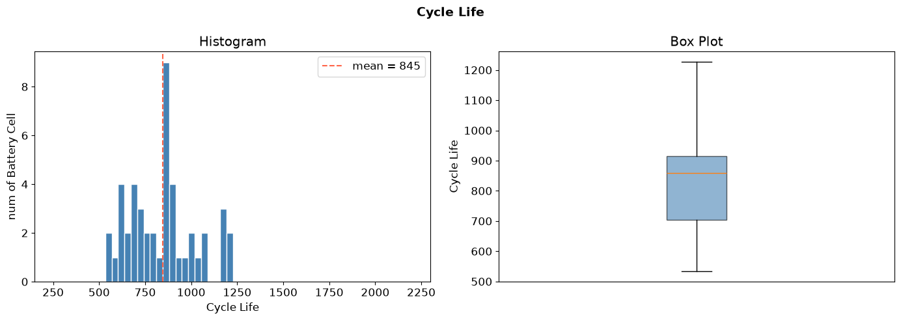
_Batch 1 Cycle Life_

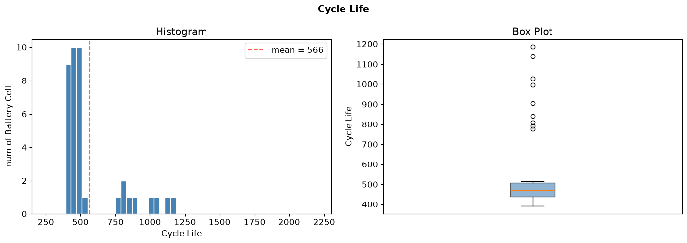
_Batch 2 Cycle Life_

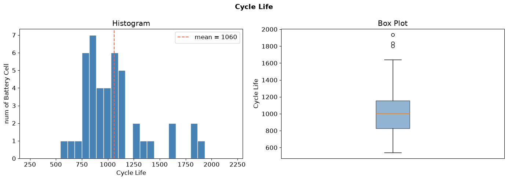
_Batch 3 Cycle Life_

**핵심: 수명은 Batch 3 > Batch 1 > Batch 2 순서다.**

- Batch 3의 평균은 Batch 2의 약 1.87배다.
- Batch 2는 평균이 중앙값보다 약 94사이클 높아 소수의 장수명 셀이 평균을 끌어올린다.
- Batch 3은 절대 표준편차가 가장 크지만, 평균 대비 표준편차는 Batch 1 약 22%, Batch 2 약 39%, Batch 3 약 30%로 Batch 2의 상대적 변동이 가장 크다.

### 장수명·단수명 비율

장수명은 `cycle_life > 1,000`, 단수명은 `cycle_life < 500`으로 정의한다. 경계값 500·1,000과 그 사이는 중간 수명에 포함한다.

| 구분                 | Batch 1           | Batch 2           | Batch 3           |
| -------------------- | ----------------- | ----------------- | ----------------- |
| 단수명(<500)         | 0/46 (**0%**)     | 28/39 (**71.8%**) | 0/44 (**0%**)     |
| 장수명(>1,000)       | 10/46 (**21.7%**) | 3/39 (**7.7%**)   | 23/44 (**52.3%**) |
| 중간 수명(500~1,000) | 36/46 (78.3%)     | 8/39 (20.5%)      | 21/44 (47.7%)     |

**핵심: 단수명 셀은 Batch 2에만 존재하고, Batch 3은 절반 이상이 장수명이다.**

- 원자료의 셀별 수명값으로 집계한 전체 129개 유효 셀에서는 장수명 36개(**27.9%**), 단수명 28개(**21.7%**), 중간 수명 65개(**50.4%**)다.

### 이상치 셀

- Batch 1·3에는 500사이클 미만 셀이 없다.
- Batch 2의 짧은 수명은 다수 셀에서 나타나므로, 500 미만이라는 이유만으로 통계적 이상치나 불량 셀로 판단할 수 없다.
- 1.5×IQR 기준 하한은
    - Batch 1: 386.7
    - Batch 2: 336.0
    - Batch 3: 337.2
- 모든 배치의 최솟값이 하한보다 높아 **수명이 짧은 방향의 boxplot 이상치는 없다**.
- Batch 2·3에서 표시된 점들은 주로 장수명 방향의 이상치다.

| 배치    | 최단수명 셀 | 수명 | 정책                          |
| ------- | ----------- | ---: | ----------------------------- |
| Batch 1 | Cell 20     |  534 | `5.4C(80%)-5.4C`              |
| Batch 2 | Cell 19     |  392 | `6C(60%)-3C`                  |
| Batch 3 | Cell 28     |  541 | `3.7C(31%)-5.9C-newstructure` |

- Batch 1·3의 최단수명 셀은 해당 배치에서 평균 수명이 가장 짧은 정책에 속한다.
- Batch 2 최단수명 셀의 첫 단계 전류는 6C지만, 평균 수명이 가장 짧은 정책은 `3.6C(9%)-5C`다.
- 따라서 첫 단계 전류 하나로 짧은 수명의 이유를 설명할 수 없다.

## 2. 열화 곡선 — 방전 용량이 어떻게 감소하는가?

### 사이클별 Qd 추이와 가속 열화

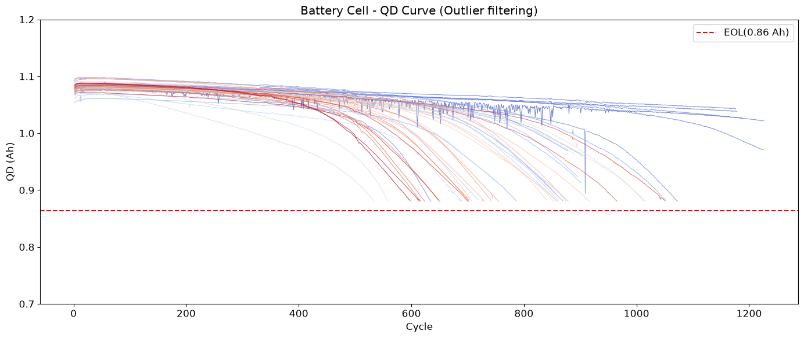
_Batch 1 QD Curve_
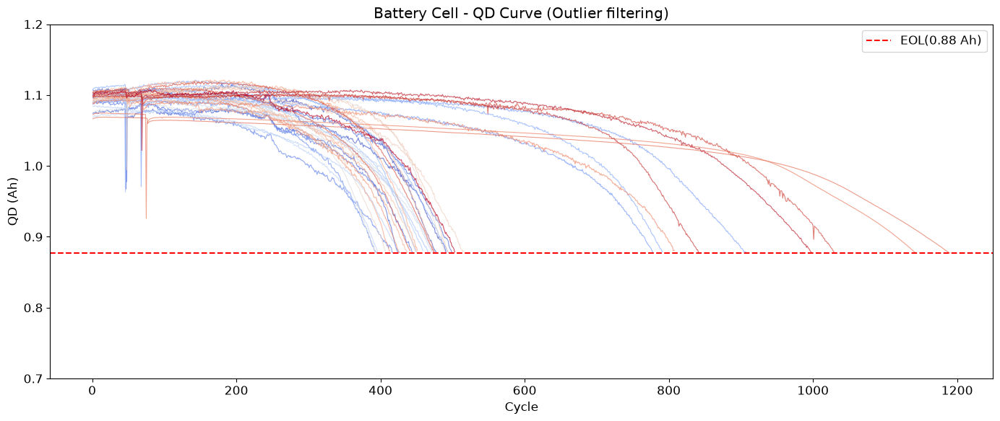
_Batch 2 QD Curve_
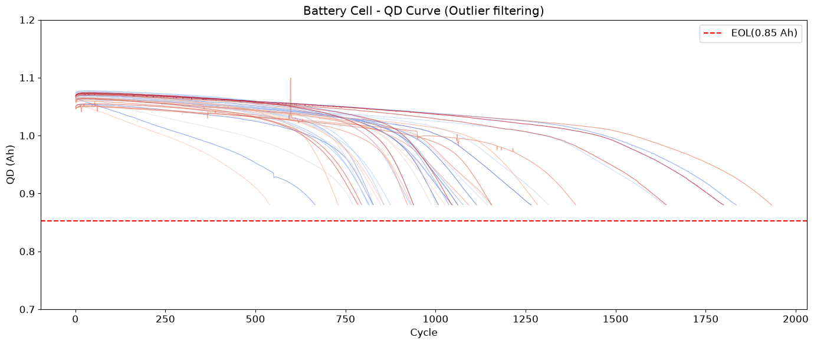
_Batch 3 QD Curve_

| 관찰                   | Batch 1                                | Batch 2                                                          | Batch 3                                                    |
| ---------------------- | -------------------------------------- | ---------------------------------------------------------------- | ---------------------------------------------------------- |
| 초기 용량(그래프 근사) | 약 1.06~1.10 Ah                        | 약 1.07~1.11 Ah                                                  | 약 1.05~1.08 Ah                                            |
| 초기 변화              | 대체로 완만한 감소                     | 일부 초기 증가 후 감소, 요동도 큼                                | 완만한 감소, 일부 셀은 일찍 하강                           |
| 후반 변화              | 일부 셀에서 400~600 이후 기울기가 커짐 | 다수 셀이 200~400 부근부터 하강이 가팔라져 400~500대에 수명 종료 | 다수 셀이 600~1,000 부근에서 급격한 하강, 일부는 훨씬 늦음 |
| 배치 특징              | 완만한 구간과 급감 구간이 공존         | 가속 열화가 이른 셀이 많음                                       | 완만한 구간이 길고 셀 간 시작점 편차가 큼                  |

**핵심: 열화 속도는 일정하지 않다.**

- 여러 곡선에서 초반의 작은 감소율이 후반에 커지는 비선형 패턴을 확인할 수 있다.
- 초기 Qd의 절대값은 배치 간에도 비슷해, 초기 용량이 큰 셀이 반드시 오래 사는 것은 아니다.
- Batch 2는 초기 용량이 비교적 높지만 평균 수명은 가장 짧다.

## 3. ΔQ(V) 곡선 — 초기 사이클에서 차이가 보이는가?

### 계산 방법과 배치별 형태

공통 전압축 `Vdlin`의 방전 용량 `Qdlin`을 사용해 다음과 같이 계산한다.

```text
ΔQ(V) = Q100(V) - Q10(V)
Q10 = cycles[9]['Qdlin']
Q100 = cycles[99]['Qdlin']
```

노트북은 전압·용량의 결측값과 무한대를 제외하고 전압 순으로 정렬한다. 서로 다른 셀의 전압 격자가 다르면 집단 비교 전에 공통 격자로 보간해야 한다.

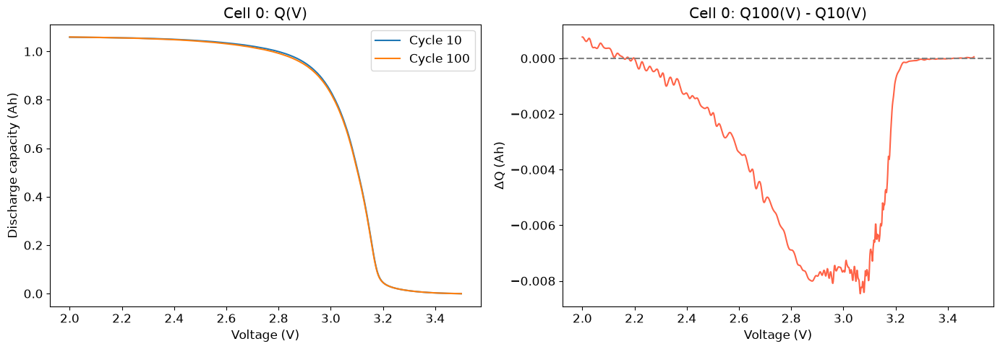
_Batch 1 ΔQ(V)_
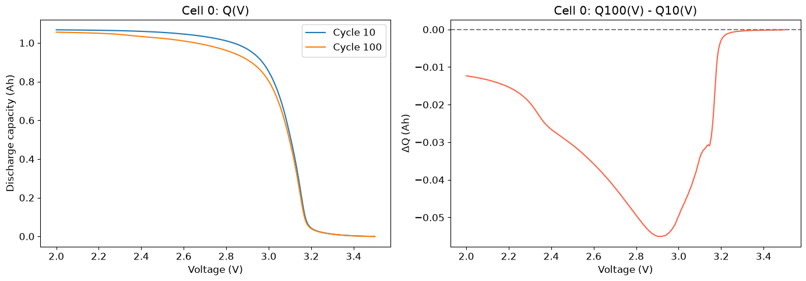
_Batch 2 ΔQ(V)_
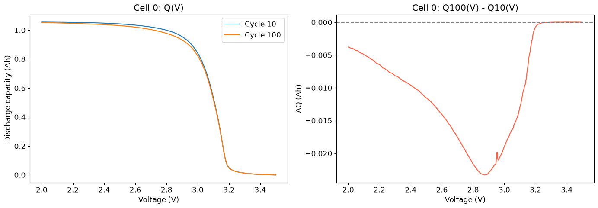
_Batch 3 ΔQ(V)_

| Cell 0 비교            | Batch 1                  | Batch 2                  | Batch 3               |
| ---------------------- | ------------------------ | ------------------------ | --------------------- |
| 수명                   | **1,190, 장수명**        | **477, 단수명**          | **1,009, 장수명**     |
| Q10과 Q100의 차이      | 원곡선은 거의 겹침       | 원곡선에서도 차이가 보임 | Batch 1보다 차이가 큼 |
| ΔQ 최솟값(그래프 근사) | 약 −0.0085 Ah            | 약 −0.055 Ah             | 약 −0.023 Ah          |
| 큰 음의 변화 구간      | 약 2.9~3.1 V             | 약 2.8~3.0 V             | 약 2.8~2.9 V          |
| 저전압부               | 2.0 V 부근에서 소폭 양수 | 저전압부도 음수          | 저전압부도 음수       |

**핵심:초기 100사이클에서도 차이는 보이며, Cell 0의 변화 크기는 Batch 2 > Batch 3 > Batch 1이다.**

- 모두 주요 변화가 약 2.8~3.1 V에 나타나고 높은 전압에서는 0에 가까워진다.
- 전체 용량이 비슷해 보여도 전압에 따른 차이를 취하면 작은 변화가 드러난다.

### 구분을 위한 피처

| 후보 피처          | 정의              | 담는 정보                                   |
| ------------------ | ----------------- | ------------------------------------------- |
| `delta_q_min`      | min(ΔQ)           | 가장 큰 음의 변화                           |
| `delta_q_mean`     | mean(ΔQ)          | 전체적인 이동량                             |
| `delta_q_var`      | Var(ΔQ)           | 전압에 따른 변화의 불균일성                 |
| `log_delta_q_var`  | log10(Var(ΔQ))    | 분산의 스케일 차이 압축; 분산 0은 별도 처리 |
| `delta_q_range`    | max(ΔQ) − min(ΔQ) | 변화 폭                                     |
| `delta_q_abs_area` | ∫\|ΔQ(V)\|dV      | 전압 범위 전체의 변화량                     |
| `voltage_at_min`   | argmin(ΔQ)의 전압 | 변화가 가장 큰 위치                         |

Batch 1·3에는 <500 집단이 없으므로 동일 배치 내 비교가 불가능하다. 전체를 합쳐 비교하면 단수명 집단이 Batch 2에만 존재하는 **배치 혼입**을 반드시 고려해야 한다.

## 4. 충전 조건(C-rate)과 수명의 관계는?

### 프로토콜별 평균 수명 비교

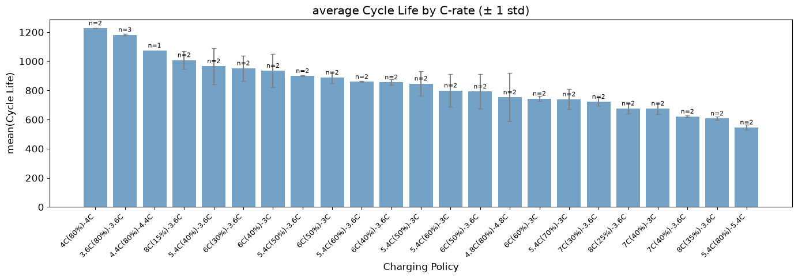
_Batch 1 C-rate_
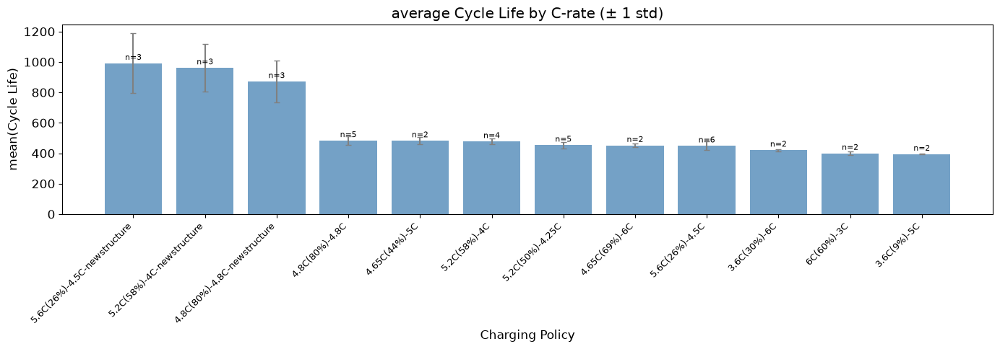
_Batch 2 C-rate_
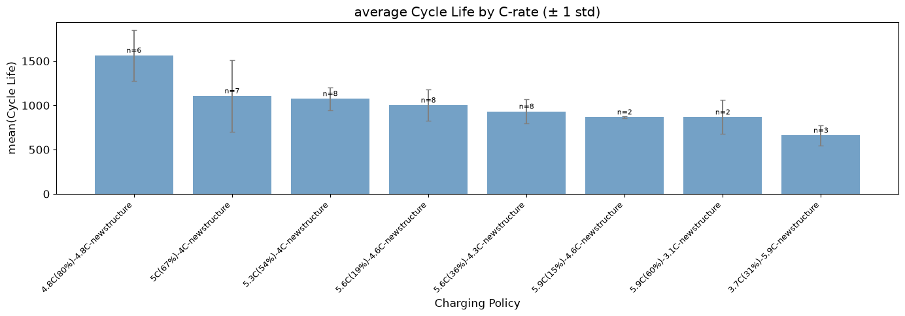
_Batch 3 C-rate_

아래 표의 정책별 평균·표본 수는 원자료에서 확인했다. 그래프의 오차막대는 ±1표준편차이며 신뢰구간이 아니다.

| 비교                       | Batch 1                                                       | Batch 2                                                   | Batch 3                                                        |
| -------------------------- | ------------------------------------------------------------- | --------------------------------------------------------- | -------------------------------------------------------------- |
| 평균 수명이 가장 긴 정책   | `4C(80%)-4C`: 1,226.5, n=2                                    | `5.6C(26%)-4.5C-newstructure`: 991.3, n=3                 | `4.8C(80%)-4.8C-newstructure`: 1,564.2, n=6                    |
| 평균 수명이 가장 짧은 정책 | `5.4C(80%)-5.4C`: 546.5, n=2                                  | `3.6C(9%)-5C`: 394.5, n=2                                 | `3.7C(31%)-5.9C-newstructure`: 660.0, n=3                      |
| 정책별 표본 수             | 1~3개                                                         | 2~6개                                                     | 2~8개                                                          |
| 주요 특징                  | 낮은 전류 정책의 수명이 대체로 길지만 전환 조건에 따라 달라짐 | `newstructure` 정책 세 종류가 상위, 단순 전류 순서와 다름 | 후반 전류가 큰 정책에서 짧은 수명 경향, 같은 정책 내 편차도 큼 |

### 고속 충전 셀이 정말 수명이 짧은가?

**핵심: 일부 배치에서는 그런 경향이 있지만, C-rate 숫자 하나로 수명을 설명할 수 없다.**

- Batch 1에서는 `4C(80%)-4C`가 `5.4C(80%)-5.4C`보다 오래 산다.
- 반면 `8C(15%)-3.6C`는 약 1,000사이클로, 초기 전류가 더 낮은 여러 정책보다 오래 산다.
- 전류의 크기와 그 전류를 적용하는 SOC 구간을 함께 봐야 한다.

- Batch 2에서는 `4.8C(80%)-4.8C-newstructure`가 약 870사이클인 반면, `4.8C(80%)-4.8C`는 약 480사이클이다.
- Batch 3의 동일한 `newstructure` 표기 정책은 약 1,560사이클이다.
- 같은 전류 표기라도 배치와 정책 세부 조건의 차이가 크다.

`C1(p%)-C2`는 1단계 전류, 전환 SOC, 2단계 전류를 함께 표현한다. 이 표기만으로 100% 완충까지 전류가 일정하다고 가정하지 않는다.

### 전류 패턴과 열화 속도의 상관

대리 지표인 **초기 100사이클 평균 충전시간과 수명**의 상관은 Batch 1 **+0.58**, Batch 2 **+0.09**, Batch 3 **+0.64**다.

Batch 1·3에서는 오래 충전하는 셀이 오래 사는 경향이 있지만 Batch 2에서는 약하다. 이 값은 전류와 열화 속도의 직접 상관계수가 아니다.

## 5. 상관관계 — 어떤 신호가 수명과 연관되어 있는가?

### 초기 100사이클 피처와 수명의 상관

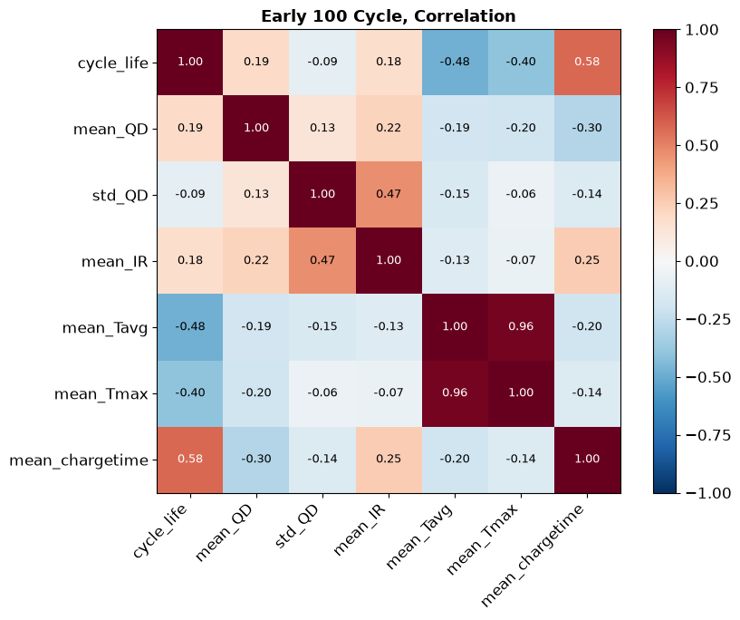
_Batch 1 Correlation Hitmap_
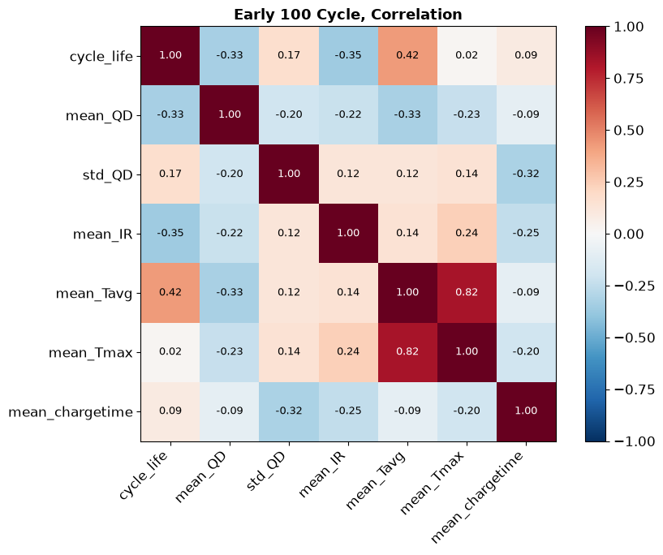
_Batch 2 Correlation Hitmap_
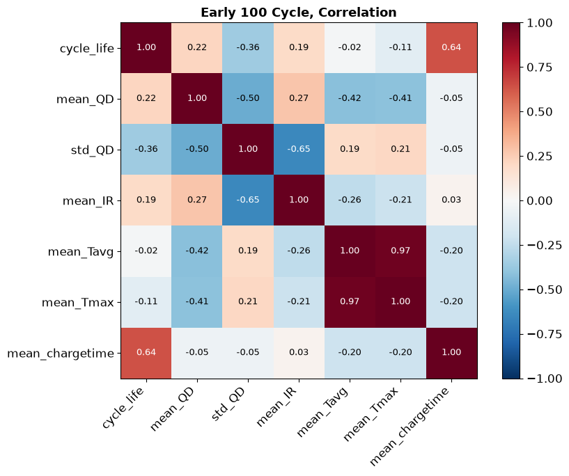
_Batch 3 Correlation Hitmap_

아래는 각 히트맵의 소수 둘째 자리 표시값이다.

| 초기 피처                         |   Batch 1 | Batch 2 |   Batch 3 |
| --------------------------------- | --------: | ------: | --------: |
| 평균 Qd (`mean_QD`)               |     +0.19 |   −0.33 |     +0.22 |
| Qd 표준편차 (`std_QD`)            |     −0.09 |   +0.17 |     −0.36 |
| 평균 내부저항 (`mean_IR`)         |     +0.18 |   −0.35 |     +0.19 |
| 평균 온도 (`mean_Tavg`)           |     −0.48 |   +0.42 |     −0.02 |
| 평균 최고온도 (`mean_Tmax`)       |     −0.40 |   +0.02 |     −0.11 |
| 평균 충전시간 (`mean_chargetime`) | **+0.58** |   +0.09 | **+0.64** |

- **Batch 1:** 평균 충전시간이 가장 강하고, 평균 온도와 평균 최고온도가 뒤를 따른다. 온도가 높은 셀일수록 수명이 짧은 방향이다.
- **Batch 2:** 평균 온도가 가장 강하다. 노트북의 정확한 출력은 `mean_Tavg +0.425`, `mean_IR −0.353`, `mean_QD −0.332`, `std_QD +0.171`, `mean_chargetime +0.087`, `mean_Tmax +0.019`다. 온도의 방향이 Batch 1과 반대다.
- **Batch 3:** 평균 충전시간이 가장 강하고 Qd 표준편차가 다음이다. 온도와 수명의 선형 관계는 약하다.

- 계산된 피처 중 가장 큰 절대 상관은 **Batch 3 평균 충전시간의 +0.64**다.
- ΔQ(V) 피처는 이 행렬에 포함되지 않아 전체 후보 중 최강이라고 결론 내릴 수 없다.
- 평균 Qd·내부저항·온도 등의 부호가 배치마다 바뀌므로, 배치를 합친 상관 하나로 공통 관계를 설명하기 어렵다.

### 다중공선성 확인

| 피처 간 상관              |   Batch 1 |   Batch 2 |   Batch 3 |
| ------------------------- | --------: | --------: | --------: |
| `mean_Tavg` ↔ `mean_Tmax` | **+0.96** | **+0.82** | **+0.97** |
| `std_QD` ↔ `mean_IR`      |     +0.47 |     +0.12 |     −0.65 |
| `mean_QD` ↔ `std_QD`      |     +0.13 |     −0.20 |     −0.50 |

**핵심: 온도 피처 두 개의 정보 중복은 세 배치 모두에서 크다.**

- 선형 회귀에 함께 넣으면 계수 추정이 불안정해질 수 있다.
- 한 개를 선택하거나 정규화를 적용하고, 최종 입력 행렬에서 VIF로 확인하는 것이 적절하다.

- Batch 3의 Qd 변동성과 내부저항도 중간 이상의 음의 상관을 보인다.

- Batch 2에는 초기 용량 스파이크 외에도 `Tmax=400`, `Tmin=−270`, `IR=0`, 매우 긴 충전시간 등 점검할 값이 있으며, 해당 값들이 초기 100사이클에도 포함되는지 확인해야 한다.
- Batch 2의 조기 가속 열화, Batch 3의 긴 완만한 구간, 배치마다 달라지는 초기 피처 관계를 보여준다.
